# Prompt Kaizen — System Documentation

> **Prompt Engineering Compatibility Analyzer.** A MERN application that scores user-written prompts against real-world scenarios across 10 parameters (out of 100), rewrites them, tracks daily streaks, runs daily challenges, hosts scheduled contests with allow-listed participants, and exposes admin tooling for operators.

This document is the single source of truth for the project's architecture, data model, feature catalog, API surface, and operational concerns. All diagrams are written in [Mermaid](https://mermaid.js.org/) so they render natively in GitHub, VS Code, and most modern markdown viewers.

---

## Table of Contents

1. [Executive Overview](#1-executive-overview)
2. [System Architecture](#2-system-architecture)
3. [Tech Stack](#3-tech-stack)
4. [Project Structure](#4-project-structure)
5. [Data Model (ER Diagram)](#5-data-model-er-diagram)
6. [Authentication & Authorization](#6-authentication--authorization)
7. [Time-Zone Model (IST)](#7-time-zone-model-ist)
8. [Feature Catalog](#8-feature-catalog)
   - 8.1 [Landing & Marketing](#81-landing--marketing)
   - 8.2 [Registration & Login](#82-registration--login)
   - 8.3 [Prompt Analyzer](#83-prompt-analyzer)
   - 8.4 [Prompt Result & Wrapped Share Card](#84-prompt-result--wrapped-share-card)
   - 8.5 [Prompt History](#85-prompt-history)
   - 8.6 [User Dashboard](#86-user-dashboard)
   - 8.7 [Daily Streak & Freezes](#87-daily-streak--freezes)
   - 8.8 [Badges](#88-badges)
   - 8.9 [Daily Challenge](#89-daily-challenge)
   - 8.10 [Weekly Recap Modal](#810-weekly-recap-modal)
   - 8.11 [Voice Prompt Input](#811-voice-prompt-input)
   - 8.12 [Celebration FX (Confetti + Chime)](#812-celebration-fx-confetti--chime)
   - 8.13 [Contests (Weekly Tests)](#813-contests-weekly-tests)
   - 8.14 [Contest Time Window](#814-contest-time-window)
   - 8.15 [Contest Countdown Timer](#815-contest-countdown-timer)
   - 8.16 [Contest Leaderboards](#816-contest-leaderboards)
   - 8.17 [Admin Console](#817-admin-console)
9. [API Reference](#9-api-reference)
10. [Design System](#10-design-system)
11. [Environment & Configuration](#11-environment--configuration)
12. [Running Locally](#12-running-locally)
13. [Open Items / Future Roadmap](#13-open-items--future-roadmap)

---

## 1. Executive Overview

Prompt Kaizen is a **three-app monorepo** built around a shared MongoDB database:

| App | Folder | Port | Purpose |
|---|---|---|---|
| **Backend API** | `Prompt Kaizen Backend` | `5000` | Express + Mongoose REST API serving both clients |
| **User Frontend** | `Prompt Kaizen Frontend` | `5173` | Vite + React UI for learners writing prompts |
| **Admin Frontend** | `Prompt Kaizen Admin` | `5174` | Operator console (user mgmt, contest authoring) |

The product loop is:

1. A learner picks a category. The system hands them a real-world **scenario**.
2. They write a **prompt** for it. The rule-based analyzer scores the prompt against 10 parameters (clarity, context, role, task, input params, output format, constraints, tone, relevance, grammar) — out of 100.
3. The user sees per-parameter scores, a heatmap, suggestions, and an **improved prompt** template they can copy or share as a 1080×1080 PNG.
4. Streaks, daily challenges, badges, and contests turn the loop into a habit.

The product is **palette-locked** to two anchor colors (`#F15D23` brand orange, `#FFFFFF` white surface) with cool grays for text, mirrored across both frontends. See each app's `tailwind.config.js` for the full scale.

---

## 2. System Architecture

### 2.1 High-Level Component Diagram

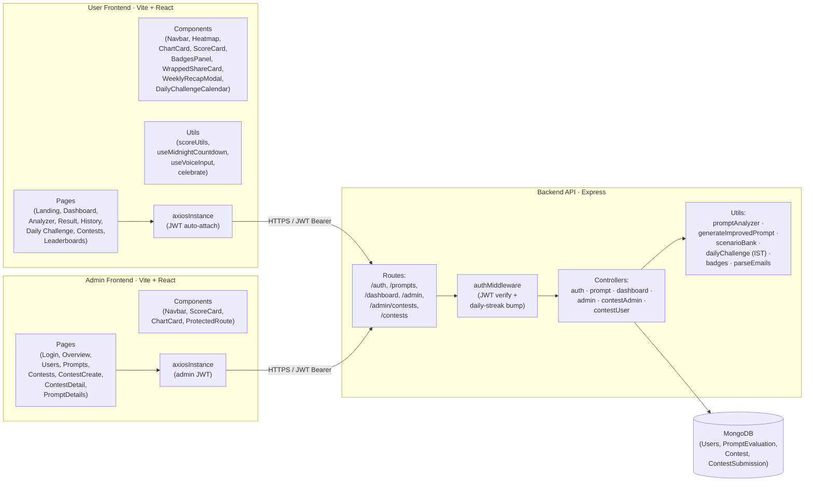

### 2.2 Request Lifecycle

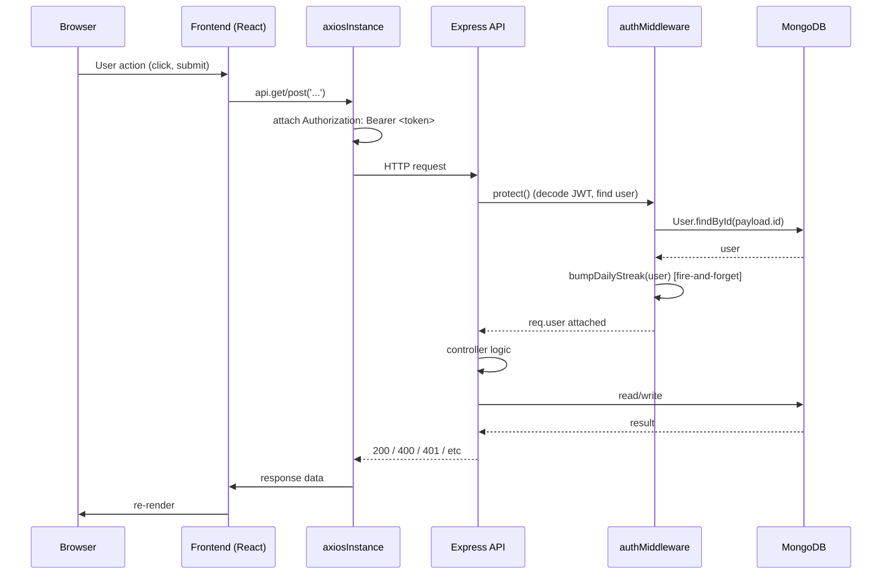

**Notes**
- A `401` triggers `axiosInstance` to clear `localStorage` and redirect to `/login`.
- The streak update is best-effort — its failure never blocks the parent request.

---

## 3. Tech Stack

| Layer | Technology | Notes |
|---|---|---|
| Frontend bundler | Vite 5 | Both user + admin |
| UI framework | React 18 | |
| Routing | React Router DOM 6 | `<Route>` + `useNavigate` |
| Styling | Tailwind CSS 3.4 | Two strict color anchors |
| Animation | Framer Motion 11 | Route transitions, stagger, layoutId pill |
| Icons | lucide-react | Single icon set across both apps |
| Charts | Recharts 2 | Dashboard charts, sparklines |
| HTTP | Axios | Interceptors for JWT |
| Confetti | canvas-confetti | Lazy-loaded on 90+ scores |
| Image export | html2canvas | For Wrapped share card |
| Backend runtime | Node 18+ | CommonJS |
| Backend framework | Express 4 | |
| DB driver | Mongoose 8 | |
| Database | MongoDB (Atlas or local) | |
| Auth | JSON Web Token | `Authorization: Bearer …` header |
| Hashing | bcryptjs | 10 rounds |
| File upload | Multer 2 | In-memory buffer for Excel |
| Excel parser | xlsx (SheetJS) | Allowlist parsing |
| Dev runner | nodemon | `npm run dev` |

---

## 4. Project Structure

```mermaid
graph TD
  ROOT["/Prompt Kaizen"]
  ROOT --> BE["/Prompt Kaizen Backend"]
  ROOT --> FE["/Prompt Kaizen Frontend"]
  ROOT --> AD["/Prompt Kaizen Admin"]
  ROOT --> DOC["README.md, DOCUMENTATION.md"]

  BE --> BE_CFG["config/db.js"]
  BE --> BE_MID["middleware/<br/>(authMiddleware,<br/>adminMiddleware,<br/>errorMiddleware)"]
  BE --> BE_MOD["models/<br/>(User, PromptEvaluation,<br/>Contest, ContestSubmission)"]
  BE --> BE_CTL["controllers/<br/>(auth, prompt, dashboard,<br/>admin, contestAdmin,<br/>contestUser)"]
  BE --> BE_RT["routes/<br/>(authRoutes, promptRoutes,<br/>dashboardRoutes, adminRoutes,<br/>contestRoutes)"]
  BE --> BE_UTL["utils/<br/>(promptAnalyzer,<br/>generateImprovedPrompt,<br/>scenarioBank, badges,<br/>dailyChallenge, parseEmails,<br/>seedAdmin)"]
  BE --> BE_SRV["server.js, .env"]

  FE --> FE_API["src/api/axiosInstance.js"]
  FE --> FE_CTX["src/context/AuthContext.jsx"]
  FE --> FE_COMP["src/components/<br/>(Navbar, ProtectedRoute,<br/>Logo, Reveal,<br/>ScoreCard, ChartCard,<br/>Heatmap, BadgesPanel,<br/>DailyChallengeCalendar,<br/>DailyChallengeCard,<br/>WeeklyRecapModal,<br/>WrappedShareCard)"]
  FE --> FE_PG["src/pages/<br/>(Landing, Login, Register,<br/>Dashboard, PromptAnalyzer,<br/>PromptResult, PromptHistory,<br/>PromptDetails,<br/>DailyChallenge,<br/>Contests, ContestTake,<br/>ContestLeaderboard,<br/>ContestSpecificLeaderboard)"]
  FE --> FE_UTL["src/utils/<br/>(scoreUtils,<br/>useMidnightCountdown,<br/>useVoiceInput, celebrate)"]
  FE --> FE_PUB["public/favicon.svg"]

  AD --> AD_API["src/api/axiosInstance.js"]
  AD --> AD_CTX["src/context/AuthContext.jsx"]
  AD --> AD_COMP["src/components/<br/>(Navbar, ProtectedRoute,<br/>Logo, Reveal,<br/>ScoreCard, ChartCard)"]
  AD --> AD_PG["src/pages/<br/>(Login, AdminDashboard,<br/>Users, Prompts, PromptDetails,<br/>Contests, ContestCreate,<br/>ContestDetail)"]
  AD --> AD_UTL["src/utils/scoreUtils.js"]
  AD --> AD_PUB["public/favicon.svg"]
```

---

## 5. Data Model (ER Diagram)

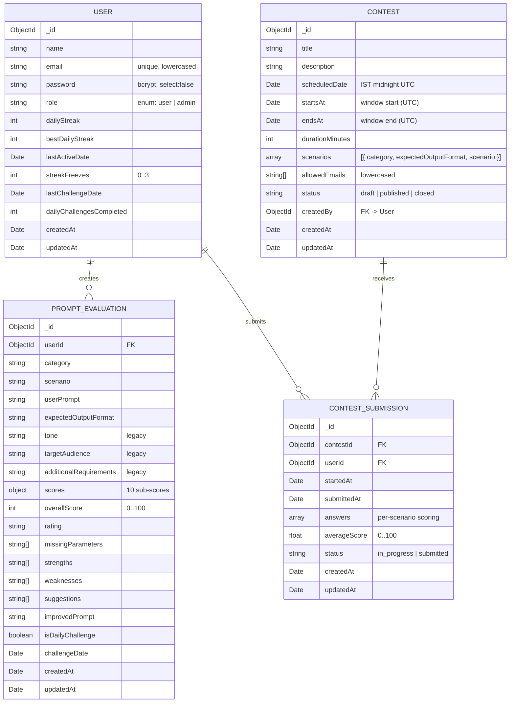

**Unique constraints**
- `User.email`
- `(ContestSubmission.contestId, ContestSubmission.userId)` — one submission per user per contest.

**Indexes**
- `PromptEvaluation.userId`
- `PromptEvaluation.isDailyChallenge`
- `Contest.scheduledDate`, `Contest.startsAt`, `Contest.endsAt`, `Contest.status`

---

## 6. Authentication & Authorization

### 6.1 Roles

| Role | Where created | Capabilities |
|---|---|---|
| `user` | self-signup (`POST /api/auth/register`) | full user app, prompt analysis, contests they're allowlisted on |
| `admin` | seed script (`npm run seed:admin`) or DB | all of the above plus `/api/admin/*` and `/api/admin/contests/*` |

### 6.2 Token Flow

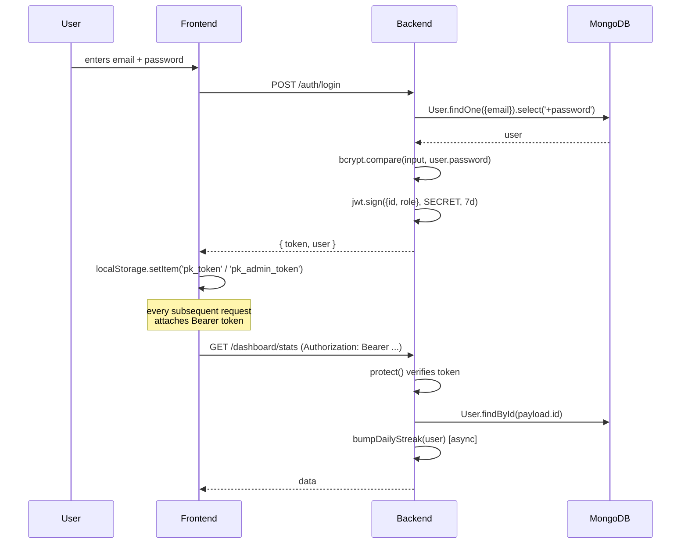

### 6.3 Isolation between user and admin sessions
- User app stores: `pk_token`, `pk_user`.
- Admin app stores: `pk_admin_token`, `pk_admin_user`.
- Even if both run side-by-side in the same browser, they cannot collide.
- Admin login client-side rejects any returned `user.role !== 'admin'`.

### 6.4 Password identifier mode
The `email` field doubles as a login identifier. It accepts:
- Real email addresses (`alice@example.com`) — typical case for users.
- Simple usernames (`Admin`, min 3 chars) — used by the seeded admin.
- Stored lowercased + trimmed; lookup normalises the input the same way.

---

## 7. Time-Zone Model (IST)

All "day boundary" logic in the system is **IST (UTC+05:30)**. Choosing a single fixed offset (no DST) keeps day rollovers deterministic globally.

| Concept | Day boundary | Implementation |
|---|---|---|
| Daily login streak | IST midnight | `bumpDailyStreak` uses `istDayDiff` |
| Daily Challenge | IST midnight | `getDailyChallenge` seeds off `istDayKey()` |
| Contest scheduledDate | IST midnight | `toIstMidnight()` clamps any input to the IST date's 00:00 |
| Contest window | exact IST `HH:MM` | `istDateTimeToUtc(dateStr, timeStr)` |
| Frontend countdown | next IST midnight | `useMidnightCountdown` |

```mermaid
flowchart LR
  U["User clock (any TZ)"]
  S["Server clock"]
  M[("MongoDB stores UTC")]
  L["UI displays IST<br/>via Intl + timeZone:'Asia/Kolkata'"]

  U -->|JS Date.now| S
  S -->|new Date()| M
  M -->|toLocaleString(timeZone Asia/Kolkata)| L
```

The IST offset is a single constant: `const IST_OFFSET_MS = 330 * 60 * 1000;`.

---

## 8. Feature Catalog

### 8.1 Landing & Marketing

**File**: [Prompt Kaizen Frontend/src/pages/Landing.jsx](Prompt Kaizen Frontend/src/pages/Landing.jsx)

A public-facing single-page marketing layout:
- Dark hero with mesh + dot-grid background, primary CTA to Register.
- Floating "live demo" preview card with a sample heatmap.
- Features grid (6 cards), how-it-works (3 steps), scoring explanation (10 parameters), final CTA.

Scroll-triggered fades via [`Reveal.jsx`](Prompt Kaizen Frontend/src/components/Reveal.jsx).

### 8.2 Registration & Login

**Files**: [Login.jsx](Prompt Kaizen Frontend/src/pages/Login.jsx), [Register.jsx](Prompt Kaizen Frontend/src/pages/Register.jsx), [AuthContext.jsx](Prompt Kaizen Frontend/src/context/AuthContext.jsx).

Split-screen layout: dark brand panel on left (logo + value props), card form on right.

**Validation**: client-side checks for required fields, password length (≥6), and password confirmation match. Server returns 409 on existing email, 401 on wrong credentials.

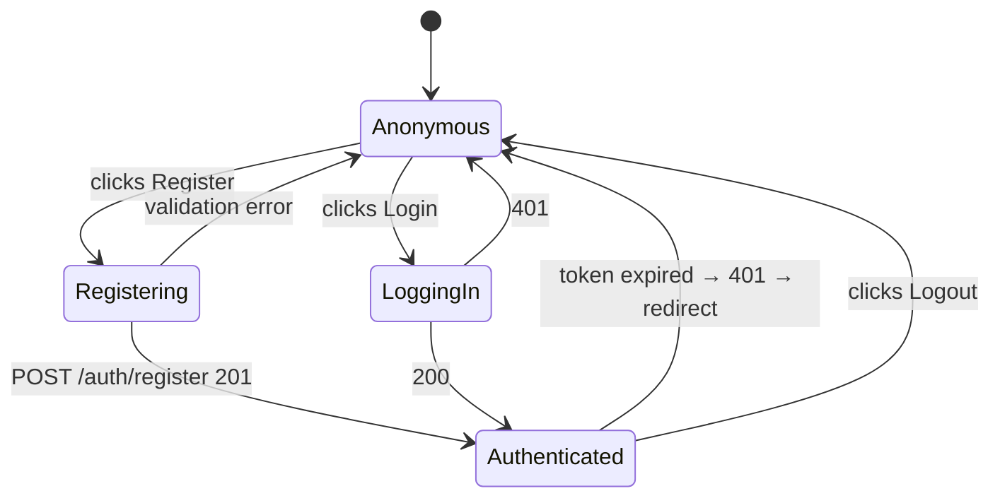

### 8.3 Prompt Analyzer

**File**: [PromptAnalyzer.jsx](Prompt Kaizen Frontend/src/pages/PromptAnalyzer.jsx) · [promptAnalyzer.js](Prompt Kaizen Backend/utils/promptAnalyzer.js) · [scenarioBank.js](Prompt Kaizen Backend/utils/scenarioBank.js)

The core flow.

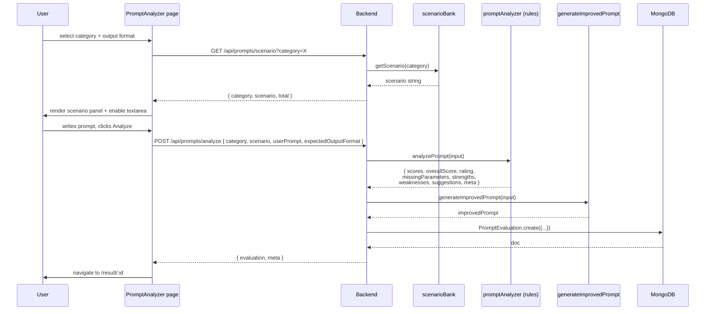

**Scoring weights** (sum = 100):

| Parameter | Max | What it tests |
|---|---|---|
| Clarity | 10 | Length + action verbs + sentence structure |
| Context | 15 | Keyword overlap with scenario |
| Role Assignment | 10 | Phrases like "Act as…", "You are…" |
| Task Definition | 15 | Action verb + length + context overlap |
| Input Parameters | 15 | Audience + extra constraints |
| Output Format | 10 | Format mention (form field or in prompt) |
| Constraints | 10 | Word limits, deadlines, sections… |
| Tone | 5 | Tone keyword present |
| Relevance | 5 | Keyword overlap with scenario |
| Grammar & Structure | 5 | Capitalisation, punctuation, sentence count |

Rating bands:
- **Excellent Prompt** ≥ 90
- **Good Prompt** 75–89
- **Average Prompt** 60–74
- **Needs Improvement** 40–59
- **Poor Prompt** < 40

### 8.4 Prompt Result & Wrapped Share Card

**Files**: [PromptResult.jsx](Prompt Kaizen Frontend/src/pages/PromptResult.jsx) · [WrappedShareCard.jsx](Prompt Kaizen Frontend/src/components/WrappedShareCard.jsx)

The result page shows:
- Big animated score circle with pulse-ring halo
- Per-parameter score bars
- Parameter heatmap
- Strengths / Weaknesses / Missing parameters cards
- Suggestions
- **Improved prompt** in a dark ink card with Copy button
- Original submission (scenario + prompt + format)

If `overallScore ≥ 90`, [`celebrate.js`](Prompt Kaizen Frontend/src/utils/celebrate.js) fires once per evaluation per browser session:
- Two-color confetti burst (locked to ink + mint)
- Two-note Web Audio API chime (C5 → E5)

The **Share Card** button captures an off-screen 1080×1080 [WrappedShareCard](Prompt Kaizen Frontend/src/components/WrappedShareCard.jsx) DOM node via `html2canvas` and shows a preview modal where the user can download the PNG.

### 8.5 Prompt History

**File**: [PromptHistory.jsx](Prompt Kaizen Frontend/src/pages/PromptHistory.jsx)

Table of every evaluation the caller has made: Date, Category, Scenario, Original Prompt, Score, Rating, View.

Daily Challenge rows are **visually highlighted** — soft mint row background, a dark left accent stripe, a `Calendar` icon prefix on the date, and a "Challenge" badge inline with the Category.

### 8.6 User Dashboard

**File**: [Dashboard.jsx](Prompt Kaizen Frontend/src/pages/Dashboard.jsx)

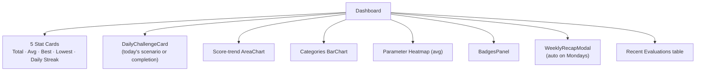

The streak card is custom (not the generic `ScoreCard`) so it can inline the freeze count and milestone hint.

### 8.7 Daily Streak & Freezes

**Files**: [authMiddleware.js](Prompt Kaizen Backend/middleware/authMiddleware.js) · [User.js](Prompt Kaizen Backend/models/User.js)

Every authenticated request runs `bumpDailyStreak(user)`. The DB is written **at most once per IST day per user**.

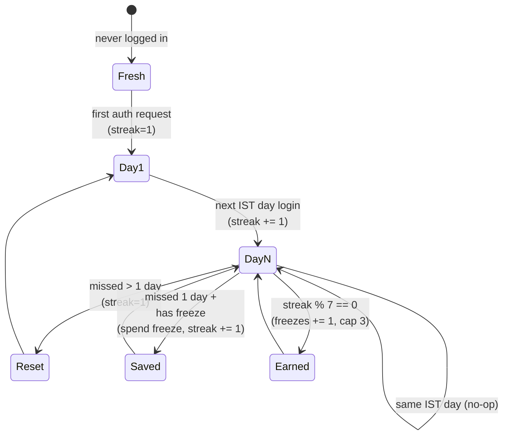

Rules:
- 1 freeze auto-earned each 7-day milestone (cap = 3).
- 1 freeze auto-spent if exactly 1 day is missed.
- 2+ missed days → streak resets to 1; freezes do **not** chain to cover more than a single missed day.
- `bestDailyStreak` only ever increases.

### 8.8 Badges

**Files**: [badges.js](Prompt Kaizen Backend/utils/badges.js) · [BadgesPanel.jsx](Prompt Kaizen Frontend/src/components/BadgesPanel.jsx)

12 deterministic badges computed on demand from existing data — no persistent badge documents to migrate. Tiers: bronze / silver / gold.

| Badge | Trigger |
|---|---|
| First Steps | ≥ 1 prompt analyzed |
| Wordsmith | ≥ 5 distinct categories |
| Explorer | ≥ 10 distinct categories |
| Polished | best score ≥ 80 |
| Excellence | best score ≥ 90 |
| Perfectionist | best score == 100 |
| Veteran | ≥ 25 prompts |
| Centurion | ≥ 100 prompts |
| Week Warrior | best streak ≥ 7 |
| Month Master | best streak ≥ 30 |
| Daily Devotee | ≥ 5 daily challenges |
| Trailblazer | ≥ 30 daily challenges |

`GET /api/dashboard/badges` returns the catalog with `unlocked` + `progress`. Locked badges render with a Lock icon and a progress bar.

### 8.9 Daily Challenge

**Files**: [dailyChallenge.js](Prompt Kaizen Backend/utils/dailyChallenge.js) · [DailyChallenge.jsx](Prompt Kaizen Frontend/src/pages/DailyChallenge.jsx) · [DailyChallengeCard.jsx](Prompt Kaizen Frontend/src/components/DailyChallengeCard.jsx) · [DailyChallengeCalendar.jsx](Prompt Kaizen Frontend/src/components/DailyChallengeCalendar.jsx)

Deterministic, identical-for-all-users scenario per IST day. The seed is `fnv1a(istDayKey())` so every user globally sees the same `(category, scenario)` on the same calendar day.

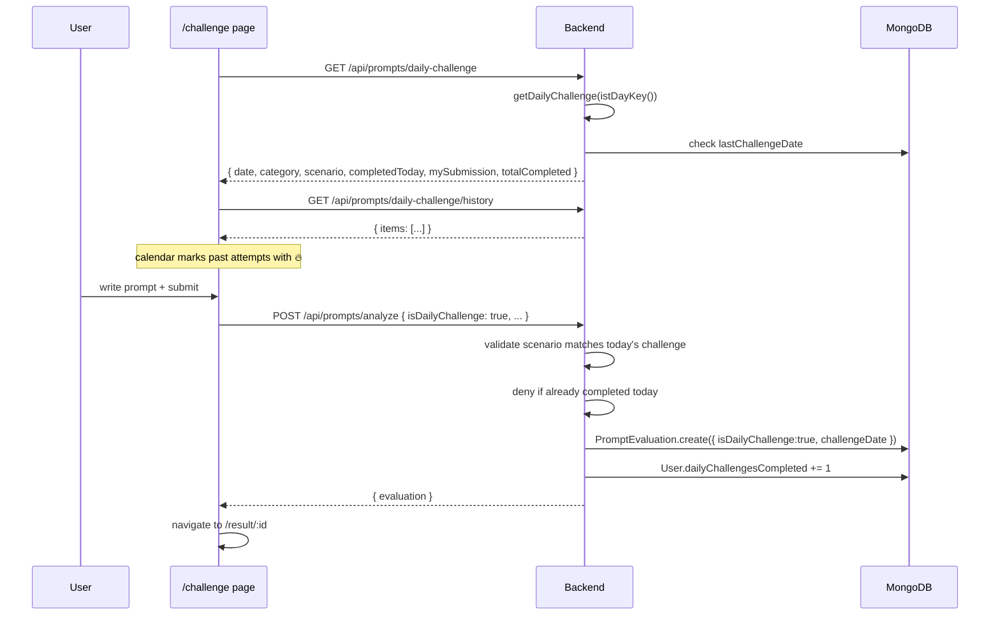

The challenge page layout:
- **Header** with live "Resets in HH:MM:SS" pill (counts to next IST midnight).
- **Scenario hero** (left) + **streak calendar** (right) in a 8/4 grid.
- 3 mini stat cards under the hero (Highest, Lowest, Average).
- Submission form OR completed state.
- Past attempts table.

### 8.10 Weekly Recap Modal

**File**: [WeeklyRecapModal.jsx](Prompt Kaizen Frontend/src/components/WeeklyRecapModal.jsx)

Auto-pops on the first dashboard visit each **Monday (UTC)**. Sticky dismissal per ISO week stored in `localStorage` under `pk_weekly_recap_week`. Skips itself if the user had zero prompts in the prior 7-day window.

Backend: `GET /api/dashboard/weekly-recap` returns counts, average, best, improvement (delta), active days, top category, top prompt of the week, and the current streak.

### 8.11 Voice Prompt Input

**File**: [useVoiceInput.js](Prompt Kaizen Frontend/src/utils/useVoiceInput.js)

Lightweight wrapper around the browser **Web Speech API** (`SpeechRecognition`). Only final transcript chunks are appended (no partials). Used inside `PromptAnalyzer.jsx`: the Dictate pill toggles `start/stop` and shows a `pulse-ring` animation while listening.

Falls back gracefully — if `SpeechRecognition` isn't supported (e.g. Firefox), the Dictate button isn't rendered at all.

### 8.12 Celebration FX (Confetti + Chime)

**File**: [celebrate.js](Prompt Kaizen Frontend/src/utils/celebrate.js)

- `fireCelebrationConfetti()` — dynamically `import('canvas-confetti')` and emits a 900 ms burst from both sides + a centre splash. Colors hard-coded to `#B0E4CC` and `#001413`.
- `playCelebrationChime()` — Web Audio API two-note chime, lazily creates an `AudioContext`.

Triggered from `PromptResult.jsx` when `overallScore ≥ 90`, gated by `sessionStorage` so revisiting a result doesn't re-fire.

### 8.13 Contests (Weekly Tests)

**Files**: [Contest.js](Prompt Kaizen Backend/models/Contest.js) · [ContestSubmission.js](Prompt Kaizen Backend/models/ContestSubmission.js) · [contestAdminController.js](Prompt Kaizen Backend/controllers/contestAdminController.js) · [contestUserController.js](Prompt Kaizen Backend/controllers/contestUserController.js)

#### 8.13.1 Admin authoring flow

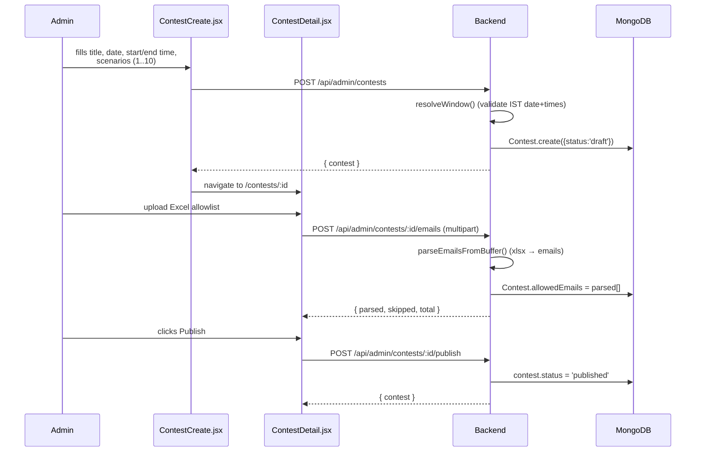

#### 8.13.2 User taking flow

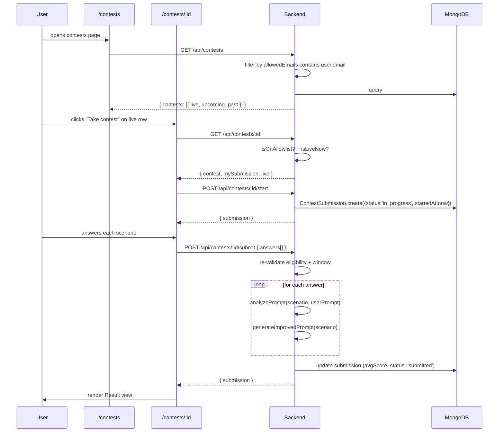

**Eligibility rules**:
- `contest.status === 'published'`
- User's email ∈ `contest.allowedEmails`
- `startsAt ≤ now ≤ endsAt`

Once submitted, the unique index on `(contestId, userId)` prevents a second submission.

### 8.14 Contest Time Window

Each contest has an exact start and end instant (`startsAt`, `endsAt`) computed from the admin-supplied IST date + start time + end time. The server uses these for eligibility, not just `scheduledDate`. Older contests created before this field existed fall back to "anywhere on the IST day".

Validation:
- Both times required if either is provided.
- `endsAt > startsAt`.
- Format strictly `HH:MM`, date `YYYY-MM-DD`.

### 8.15 Contest Countdown Timer

**File**: [ContestTake.jsx](Prompt Kaizen Frontend/src/pages/ContestTake.jsx) — `ContestTimer` component (inline)

Floating pill, `fixed top-20 right-4`, re-rendered once per second.

`deadline = min(endsAt, startedAt + durationMinutes)`.

Visual states (all within ink/mint palette):
- **Normal** > 5 min: white card.
- **Low** < 5 min: dark ink card.
- **Critical** < 60 s: dark ink card + `animate-pulse-ring`.
- **Expired** = 0: dark card showing "Time's up".

**Auto-submit**: triggers when remaining ≤ 3 s. Sends current answers silently to give a buffer for network latency. The Submit button locks once auto-submit is in flight to prevent double-submits.

### 8.16 Contest Leaderboards

Two distinct leaderboards now exist:

#### 8.16.1 Overall (cross-contest)

**File**: [ContestLeaderboard.jsx](Prompt Kaizen Frontend/src/pages/ContestLeaderboard.jsx) — route `/contests/leaderboard`

Aggregates every user's submitted contests:
```
avgScore   = AVG(averageScore across their submitted contests)
avgTimeMs  = AVG(submittedAt - startedAt)
bestScore  = MAX(averageScore)
contests   = COUNT
```
Sort: `avgScore DESC, avgTimeMs ASC`.

#### 8.16.2 Per-contest

**File**: [ContestSpecificLeaderboard.jsx](Prompt Kaizen Frontend/src/pages/ContestSpecificLeaderboard.jsx) — route `/contests/:id/leaderboard`

Only ranks submissions to that specific contest:
```
score   = averageScore on this contest
timeMs  = submittedAt - startedAt for this attempt
```
Same sort rule. Open to anyone on that contest's allowlist regardless of its status (so participants can review results after a closed contest).

Both pages share visual language: podium for top 3 (Trophy / Award / Medal icons), a full table, and a "You" highlight on the caller's row.

### 8.17 Admin Console

**Files**: see `/Prompt Kaizen Admin/src/pages/*`

| Page | Capability |
|---|---|
| `Overview` (`/`) | Platform totals, category bar chart, recent users, recent evaluations |
| `Users` (`/users`) | Searchable list of every user, role badges (admin = ShieldCheck) |
| `Prompts` (`/prompts`) | Searchable + category-filterable list of every evaluation |
| `Prompt Details` (`/prompts/:id`) | Full evaluation view (same shape as user-facing result page) |
| `Contests` (`/contests`) | List of contests with stat strip (5 cards) and per-row status/window |
| `Contest Create` (`/contests/new`) | Multi-scenario authoring form + window pickers |
| `Contest Detail` (`/contests/:id`) | Status actions (Publish/Close/Delete), Excel uploader, scenarios preview, ranked submissions table |

Admin's contest stat strip computes:
- Assigned (total)
- Scheduled (published + endsAt in future)
- Closed (status=closed OR window ended)
- Total Attendees (Σ submittedCount)
- Average Score (weighted: Σ(avgScore × submitted) / Σ submitted)

---

## 9. API Reference

All endpoints prefixed `/api`. Protected routes require `Authorization: Bearer <token>`.

### 9.1 Auth (`/api/auth`)
| Method | Path | Auth | Body / Query | Description |
|---|---|---|---|---|
| POST | `/register` | no | `{ name, email, password, confirmPassword }` | Create account, return `{ token, user }` |
| POST | `/login` | no | `{ email, password }` | Issue token |
| GET | `/me` | yes | — | Echo current user |

### 9.2 Prompts (`/api/prompts`) — all protected
| Method | Path | Body / Query | Description |
|---|---|---|---|
| GET | `/scenario` | `?category=&exclude=` | Random scenario from bank for category |
| GET | `/daily-challenge` | — | Today's IST daily challenge + caller's completion status |
| GET | `/daily-challenge/history` | — | All caller's submitted daily challenges |
| POST | `/analyze` | `{ category, scenario, userPrompt, expectedOutputFormat, isDailyChallenge? }` | Score + persist evaluation |
| GET | `/history` | — | All evaluations by caller |
| GET | `/:id` | — | One evaluation (owner or admin) |
| DELETE | `/:id` | — | Delete (owner or admin) |

### 9.3 Dashboard (`/api/dashboard`) — all protected
| Method | Path | Description |
|---|---|---|
| GET | `/stats` | Totals, average, best, lowest, streak, freezes, parameter averages, recent items |
| GET | `/badges` | Catalog with `unlocked` + `progress` |
| GET | `/weekly-recap` | Last-7-IST-day summary |

### 9.4 Contests — user (`/api/contests`) — all protected
| Method | Path | Description |
|---|---|---|
| GET | `/` | Contests the caller is allowlisted on (with live/upcoming/past flags) |
| GET | `/leaderboard` | Overall cross-contest leaderboard |
| GET | `/:id` | Contest details + caller's submission state |
| GET | `/:id/leaderboard` | Per-contest leaderboard |
| GET | `/:id/result` | Caller's own contest result |
| POST | `/:id/start` | Create in-progress submission |
| POST | `/:id/submit` | Score + finalise all answers |

### 9.5 Contests — admin (`/api/admin/contests`) — protected + adminOnly
| Method | Path | Body | Description |
|---|---|---|---|
| GET | `/` | — | List with submission counts + avgScore |
| POST | `/` | `{ title, description, scheduledDate, startTime, endTime, durationMinutes, scenarios[] }` | Create draft |
| GET | `/:id` | — | Detail + populated submissions |
| PUT | `/:id` | partial | Edit (rejects if closed) |
| DELETE | `/:id` | — | Hard delete (cascades submissions) |
| POST | `/:id/emails` | multipart `file=`, `mode=replace|append` | Parse Excel/CSV → allowlist |
| POST | `/:id/publish` | — | Set status=published (requires allowlist + ≥1 scenario) |
| POST | `/:id/close` | — | Set status=closed |

### 9.6 Admin (`/api/admin`) — protected + adminOnly
| Method | Path | Description |
|---|---|---|
| GET | `/stats` | Platform totals + categoryCount + recent users / prompts |
| GET | `/users` | All users |
| GET | `/prompts` | All evaluations populated with user |

---

## 10. Design System

### Tokens

Colour is defined once in `.design/tokens.css` and synced into both apps at
`src/styles/tokens.css`. Values are **semantic roles**, not a numeric scale:

| Token | Role |
|---|---|
| `--ink`, `--ink-soft`, `--ink-muted`, `--ink-faint` | Text, most to least prominent |
| `--canvas`, `--surface`, `--surface-raised`, `--surface-sunken` | Page, cards, modals, wells |
| `--border`, `--border-strong` | Hairlines and emphasised edges |
| `--brand`, `--brand-hover`, `--brand-fg`, `--brand-text` | Fills, hover, text-on-fill, brand-as-text |
| `--panel`, `--panel-fg`, `--panel-fg-soft` | Inverted hero blocks |
| `--positive`, `--warning`, `--danger` | Feedback |

The previous `flame`/`cream` scales were replaced because they were overloaded:
`flame-400/500/600` were brand orange while `flame-700/900` were greys, and
**`flame-900` was both the primary text colour and the dark panel background**.
Those two roles move in opposite directions in a dark theme, so no variable
swap could satisfy both.

`--brand` and `--brand-text` are separate for the same reason: the true brand
orange `#F15D23` scores only **3.32:1** on white, so as body text it failed
WCAG AA everywhere it appeared. Fills keep the exact brand colour (white on it
clears 3:1 for large/bold); brand-as-text is deepened to `#C2470F` (5.0:1) in
light and lifted to `#FF8A5C` (7.6:1) in dark.

### Theming

Dark mode is `data-theme="dark"` on `<html>`, set by an inline script in
`index.html` **before first paint** — applying it from a `useEffect` would show
every dark-mode user a white flash on each load.

Three states: `light`, `dark`, `system` (default). `system` is a real state that
follows the OS live, not a synonym for whichever theme is active.

Recharts and react-hot-toast take colour props rather than class names, so they
read the tokens back off the document via `useChartTheme()` and `ThemedToaster`.

`scripts/verify-theme.cjs` resolves the built CSS and fails CI if any themed
class stops responding to the theme — the failure mode this approach is most
prone to, because it breaks silently rather than breaking the build.

### Accessibility

- All text tokens meet WCAG AA (4.5:1) in both themes; `--ink-faint` clears the 3:1 incidental floor.
- Skip link is first in the tab order; focus moves to `<main>` on route change.
- `prefers-reduced-motion` disables the Framer Motion transitions.
- `color-scheme` is set per theme so native scrollbars, form controls and autofill follow.

---


## 11. Environment & Configuration

### 11.1 Backend `.env`
```
PORT=5000
MONGO_URI=mongodb+srv://...
JWT_SECRET=<strong secret>
JWT_EXPIRES_IN=7d
CLIENT_URL=http://localhost:5173,http://localhost:5174

ADMIN_NAME=Admin
ADMIN_EMAIL=Admin
ADMIN_PASSWORD=Admin123
ADMIN_RESET_PASSWORD=true
```

### 11.2 User Frontend `.env`
```
VITE_API_BASE_URL=http://localhost:5000/api
```

### 11.3 Admin Frontend `.env`
```
VITE_API_BASE_URL=http://localhost:5000/api
```

### 11.4 Port notes
The backend defaults to port 5000. On macOS Monterey+, port 5000 is also used by AirPlay Receiver — if you get `EADDRINUSE`, either turn off AirPlay Receiver in System Settings → General → AirDrop & Handoff, or temporarily set `PORT=5001` in `.env`.

---

## 12. Running Locally

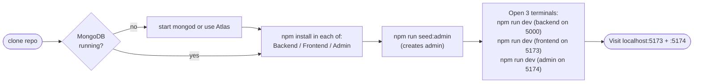

---

## 13. Open Items / Future Roadmap

### Delivered since this document was first written

These were listed as open and are now implemented — see the referenced tests.

| Item | Where |
|---|---|
| Email verification on signup | OTP flow, `tests/security.test.js` |
| Rate limiting on `/auth` | Tiered limiters in `server.js` |
| Forgot password / reset flow | `tests/password-reset.test.js` |
| Toast notification system | `react-hot-toast` across both apps |
| Audit log for admin actions | `models/AuditLog.js` |
| Anti-cheat: paste detection | `lockClipboard.js` + server-side echo/paste detection |
| Pagination on long tables | `utils/pagination.js`, `tests/pagination.test.js` |
| Tests (unit + integration) | `Prompt Kaizen Backend/tests/` — 112 assertions |
| CI/CD pipeline | `.github/workflows/ci.yml` |
| Logging beyond morgan | Structured JSON logs + request ids, `middleware/requestContext.js` |
| Real LLM rewrite | `utils/llmAnalyzer.js`, opt-in via `LLM_ANALYSIS_ENABLED` |
| Light + dark theming | `.design/tokens.css`, `ThemeContext.jsx`, verified by `scripts/verify-theme.cjs` |
| Code splitting | Route-level `React.lazy`; entry bundle 921 KB → 388 KB |
| Error boundaries | `components/ErrorBoundary.jsx`, per-route |
| Accessibility | Skip link, route focus management, reduced-motion support, AA contrast in both themes |
| Command palette | Not built — deliberately dropped as low value next to the above |

### Still open

**Product**
- Profile / account settings page — name, email, password change.
- Export contest submissions as CSV for offline grading.
- Per-scenario time limits within a contest.
- Email notification when a contest goes live.
- USN-based allowlist (planned migration away from email).

**Engineering**
- **Shared package.** `scoreUtils`, the axios setup and the design system are copied between the two frontends. Phase 3 made the design tokens a single source in `.design/` synced into both, but that is a build-time copy, not a real shared package.
- **Frontend tests.** The backend has coverage; the React apps have none beyond the build and the theme-integrity check.
- **Scoring calibration.** `scoredBy` distinguishes rule-scored from LLM-scored evaluations, but nothing yet measures agreement between them on real submissions.
- **Bundle.** The dashboard chunk is still ~420 KB because Recharts is large; a lighter chart library or a partial import would cut it further.

---

## Glossary

| Term | Meaning |
|---|---|
| **IST** | India Standard Time, UTC+5:30, fixed offset (no DST) |
| **Allowlist** | Set of lowercased email addresses permitted to view/take a contest |
| **Streak** | Number of consecutive IST days a user has authenticated (boundary is IST midnight) |
| **Freeze** | A consumable that survives one missed day; auto-earned every 7 streak days, capped at 3 |
| **Daily Challenge** | A globally identical scenario chosen deterministically per IST day |
| **Contest** | Admin-scheduled multi-scenario test with a precise IST start/end window and an email allowlist |
| **Submission** | A user's attempt at a contest; one per `(contestId, userId)` |
| **Wrapped Card** | 1080×1080 PNG share image generated for a prompt evaluation |
| **Rating band** | Human-readable score tier (Excellent / Good / Average / Needs Improvement / Poor) |

---

*Last revised after Phase 2: security hardening, contest integrity, hybrid LLM scoring,
pagination, structured logging, CI and deployment configuration. Sections 1–12 describe
the architecture, which is unchanged; section 13 tracks what has shipped since.*
